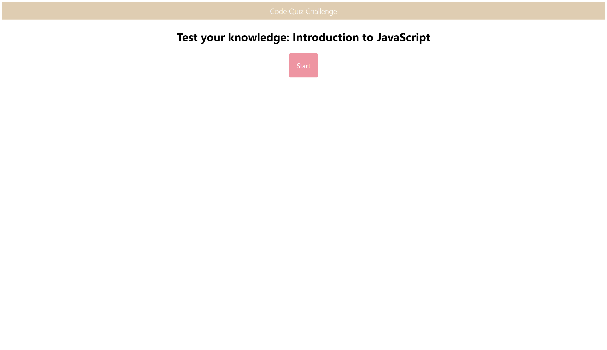
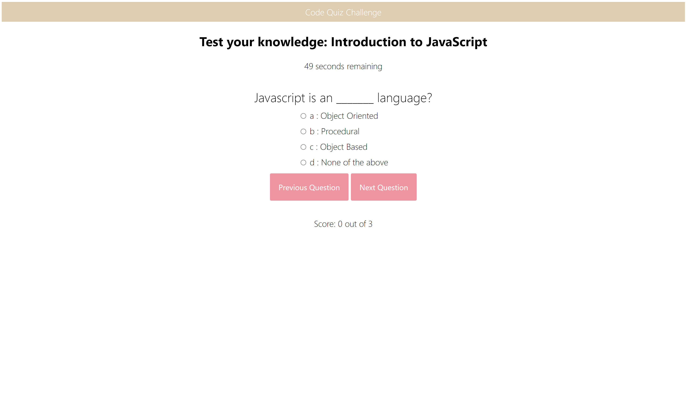
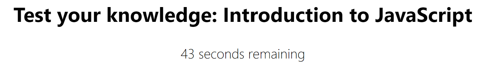
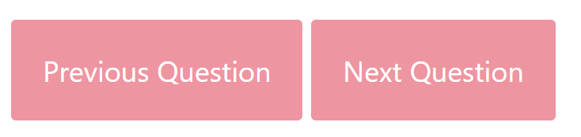
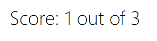
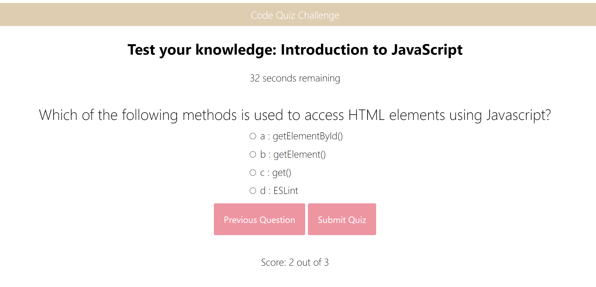
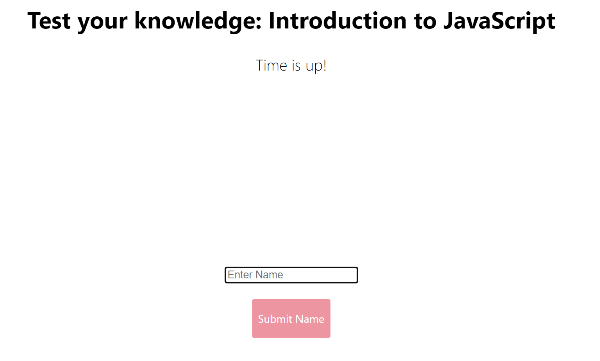
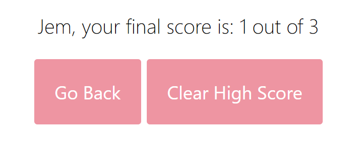

# Code-Quiz-by-Jemima-Siddiqui

Homework Assignment for Week 4 by Jemima Siddiqui. 

# 04 About the Project - Code Quiz

The Code Quiz project consists of a quiz which has a series of questions for the user to answer. The user is first presented with a start/homepage, in which they can click the "Start" button to start the quiz. Once they click on this button, a timer starts and they are presented with a series of questions (one question per page) which they can answer using multiple choice answers. They can also navigate to previous and next pages on the quiz. Once they submit the quiz, they are required to enter their initials into an input box to see their final score. They can then clear their score, or navigate back to the start/homepage to redo the quiz. 



## Acceptance Criteria

The Code Quiz application fulfills the following acceptance criteria: 
* when I click the start button, then a timer starts and I am presented with a question
* when I answer a question, then I am presented with another question
* when all questions are answered or the timer reaches 0, then the game is over
* when the game is over, then I can save my initials and my score

## Installation

### Viewing the homepage 

In order to access the Code Quiz application, navigate to the following link: 
 [Code quiz page](https://jemimasiddiqui.github.io/Code-Quiz-by-Jemima-Siddiqui/). 

### Downloading Visual Studio Code 

 Download the latest version of Visual Studio to your local machine (Mac, Linux or Windows). Please use the following link to download the latest version of VS Code [Download VS Code](https://code.visualstudio.com/download). 

### Pulling the repository from Git 

If you would like to acess the source code (HTML, CSS and JavaScript files), please navigate to the following public Github repository [Github Repository](https://github.com/JemimaSiddiqui/Code-Quiz-by-Jemima-Siddiqui.git). 

* Clone the repository to your local desktop using the following steps:

  * 🔑 Use the terminal command `cd` to navigate to the directory where we want the repository located. In this case, we will save it to the Desktop. 

  ```bash
  cd Desktop
  ```

  * 🔑 Use the git command `git clone` followed by the URL copied from Github to clone the repo to our local machine.

  ```bash
  git clone <url>
  ```

  * 🔑 Use the `git clone` command creates a new directory with the same name as the repository. We navigate into our new directory using `cd`.

  ```bash
  cd Code-Quiz-by-Jemima-Siddiqui
  ```
* After the repository has been cloned to your local machine, open the HTML, CSS and JavaScript files using Visual Studio application. 

## Usage 

This section contains instructions on how to use the Code Quiz application. 

1. Application page: 

The start/homepage page consists of a "Start" button which users can click on to start the timed quiz. 


2. Question Pages:

Once users click on the "Start" button, they are presented with a series of multiple-choice questions which they can choose to answer or leave blank and go to the next question



3. Timer:

There is a timer that starts when the user starts the quiz. 



4. Previous and Next button: 

On each question page, the user can answer the question (they can also choose not to answer the question) and click next to go to the next question. The user can also click on previous to go to the previous question. 



5. Score for each question: 

At the bottom of the page, the user is also shown their current score based on their response to the previous question. This tells the user whether their answer to the previous question was correct or incorrect. The score is not shown on the page of the last question. 



6. Submit quiz: 

When on the last question, the user can then submit the quiz. 



7. Input initials: 
Once the quiz is submitted, the user is presented with an input box in which they can type their initials and submit initials to see their final score. 



8. High score display: 
Once the user submit their initials, they are presented with their final score. They can then click on clear high score to clear the score displayed on the page, or they can click on go back to navigate to the start and redo the quiz. 



## Credits

* This README.md file was created through the help of the following tutorial: [Professional README Guide](https://coding-boot-camp.github.io/full-stack/github/professional-readme-guide).

## Main Features

* This webpage consists of the following features: 
  * A scalable, timed Code Quiz on JavaScript fundamentals. 
  * A series of multiple choice questions to be answered. 
  * Individual scores and a final score at the end of the quiz, after submission.
---
© 2022 Trilogy Education Services, LLC, a 2U, Inc. brand. Confidential and Proprietary. All Rights Reserved.

